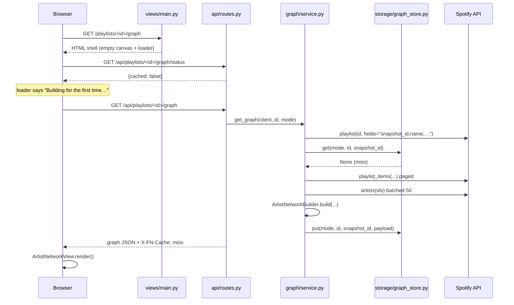

# Feature Network

A Flask + D3 web app that turns a Spotify playlist into a **collaboration network**: every
artist is a node, every link is a pair of artists who appear together on a track in that
playlist.

- Sign in with your own Spotify account (OAuth 2.0 — multi-user, no hardcoded credentials).
- Pick any of your playlists, or your Liked Songs.
- Click an **artist node** → the songs by that artist that live in the playlist.
- Click a **link** → the songs those two artists made together.
- Graphs are cached to disk on first build and served instantly afterwards.

---

## Quick start

```bash
cd FeatureNetwork

# 1. Python 3.10+ is required (the dataclasses use slots=True).
python3.12 -m venv .venv
source .venv/bin/activate
pip install -r requirements.txt

# 2. Configure credentials.
cp .env.example .env
$EDITOR .env

# 3. Run.
python run.py          # http://127.0.0.1:5000
```

### Getting Spotify credentials

1. Create an app at <https://developer.spotify.com/dashboard>.
2. Copy the **Client ID** and **Client Secret** into `.env`.
3. In the app's settings, add this **exact** redirect URI:

   ```
   http://127.0.0.1:5000/auth/callback
   ```

   Spotify does a literal string match — `localhost` is *not* interchangeable with
   `127.0.0.1`, and a trailing slash will break it.
4. Generate a session signing key:

   ```bash
   python -c "import secrets; print(secrets.token_urlsafe(48))"
   ```

   Put it in `FLASK_SECRET_KEY`. Changing this value logs everyone out.

> Spotify apps start in **development mode**, which only lets accounts you explicitly add
> under *Settings → User Management* log in. Add your own email there.

### Tests

```bash
.venv/bin/python -m pytest tests/ -q     # 42 tests, no network access needed
```

---

## Project layout

```
FeatureNetwork/
├── run.py                  # entry point: loads .env, then creates the app
├── config.py               # BaseConfig + dev/prod/testing, OAuth scopes, cache tuning
├── requirements.txt
├── .env.example
│
├── app/
│   ├── __init__.py         # create_app() factory: logging, blueprints, error handlers
│   ├── errors.py           # AppError hierarchy + HTML/JSON content negotiation
│   │
│   ├── auth/               # everything OAuth
│   │   ├── session.py      # FlaskSessionCacheHandler — tokens live in the cookie session
│   │   ├── decorators.py   # @login_required (redirect) / @api_login_required (401 JSON)
│   │   └── routes.py       # /auth/login, /auth/callback, /auth/logout
│   │
│   ├── spotify/            # the only layer that talks to the Spotify Web API
│   │   ├── client.py       # builds the OAuth manager + an authenticated spotipy client
│   │   ├── playlists.py    # paginated track fetch with a narrow `fields` mask
│   │   ├── artists.py      # batched artist metadata (50 per request)
│   │   └── library.py      # Liked Songs as a synthetic playlist
│   │
│   ├── graph/
│   │   ├── models.py       # THE data contract: Track, Artist, GraphNode, GraphLink, Graph
│   │   ├── service.py      # orchestration: cache probe → fetch → build → cache write
│   │   ├── analytics.py    # pandas aggregates (top collaborators, histograms)
│   │   └── builders/
│   │       ├── base.py             # GraphBuilder ABC + MetadataResolver Protocol
│   │       ├── artist_network.py   # ★ the MVP algorithm
│   │       ├── genre_network.py    # future mode (available = False)
│   │       └── __init__.py         # mode registry
│   │
│   ├── storage/
│   │   └── graph_store.py  # snapshot-keyed JSON cache on disk
│   │
│   ├── api/routes.py       # JSON API consumed by the frontend
│   ├── views/main.py       # HTML pages
│   ├── templates/
│   └── static/
│       ├── css/
│       └── js/
│           ├── api.js              # fetch wrapper; 401 → bounce to login
│           ├── format.js
│           ├── graph/
│           │   ├── artistNetworkView.js        # ★ the D3 force simulation
│           │   ├── detailPanel.js              # node-click and link-click panels
│           │   └── genreCirclePackingView.js   # future circle-packing stub
│           └── pages/
│
├── data/cache/graphs/     # generated; gitignored
├── docs/
└── tests/
```

### Why the layering

The rule is **inward-only dependencies**:

```
views / api  →  graph.service  →  graph.builders  →  graph.models
                     ↓
                spotify.*  →  Spotify Web API
                storage.*  →  disk
```

`graph/builders/` imports neither Flask nor spotipy. That is what lets
`tests/test_artist_network_builder.py` test the pair-generation algorithm against a
dict-backed `FakeResolver` instead of mocking HTTP.

---

## How a request flows



The second request for the same playlist stops at the `C-->>S` step and returns
`X-FN-Cache: hit` with zero Spotify track calls.

---

## The caching model

Cache path:

```
data/cache/graphs/<mode>/<playlist_id>/<snapshot_id>.json
```

Spotify gives every playlist a `snapshot_id` that changes whenever the playlist is
mutated. Using it as the cache key means:

- **Exact invalidation, for free.** Add a song → new `snapshot_id` → guaranteed miss. No
  TTLs to guess at, no stale graphs.
- **Cheap probe.** `service._resolve_ref()` fetches *only* the metadata fields
  (`snapshot_id`, `name`, `images`, …) before deciding whether to fetch tracks at all.
- **Mode isolation.** `artist/` and `genre/` graphs never collide.

Other properties worth knowing:

| Behaviour | Where |
| --- | --- |
| Writes are atomic (`NamedTemporaryFile` + `os.replace`) — no torn JSON on crash | `graph_store.put` |
| Old snapshots pruned to `CACHE_KEEP_SNAPSHOTS` (default 3) | `graph_store._prune` |
| Corrupt JSON is unlinked and treated as a miss, never raised | `graph_store.get` |
| Playlist IDs are validated against `^[A-Za-z0-9_=.-]{1,128}$` before touching the FS | `graph_store.path_for` |
| Liked Songs gets a synthetic `snapshot_id` of `f"{total}-{latest_added_at}"` | `library.liked_songs_ref` |

Force a rebuild with `?refresh=1`, or `DELETE /api/playlists/<id>/graph`.

---

## The algorithm

`ArtistNetworkBuilder._collect_pairs` is the core:

```python
for track in tracks:
    artist_ids = sorted(set(track.artist_ids))   # sorted → canonical; set → no self-loop
    for i in range(len(artist_ids)):
        for j in range(i + 1, len(artist_ids)):
            pairs[(artist_ids[i], artist_ids[j])].append(track.id)
```

Two details do a lot of work:

- **`sorted(...)`** makes each pair canonical, so credit order can never produce both
  `(a, b)` and `(b, a)` as separate links.
- **`set(...)`** drops duplicate credits on one track, which would otherwise produce an
  `(a, a)` self-loop.

Each pair appears **exactly once** in the output and carries its `track_ids` list — which
is precisely what makes the link-click interaction a dict lookup rather than a query.

Tracks are stored once in a single id-keyed `graph.tracks` dict; nodes and links hold only
IDs. On a 500-track playlist that is the difference between a ~400 KB payload and several MB.

---

## API

All endpoints require a session; without one they return `401 {"error": "not_authenticated", "login_url": ...}`.

| Method | Path | Purpose |
| --- | --- | --- |
| `GET` | `/api/me` | Current Spotify profile |
| `GET` | `/api/modes` | Available graph modes + the default |
| `GET` | `/api/playlists` | Playlists, with Liked Songs pinned first |
| `GET` | `/api/playlists/<id>` | One playlist's metadata |
| `GET` | `/api/playlists/<id>/graph` | Build or serve the graph. `?mode=`, `?refresh=1` |
| `GET` | `/api/playlists/<id>/graph/status` | `{cached: bool}` — lets the loader pick its message |
| `DELETE` | `/api/playlists/<id>/graph` | Drop every cached snapshot for that playlist |
| `PUT` | `/api/playback/track/<id>` | Start playback (Premium + an active device) |
| `GET` | `/api/cache` | Cache inventory. **DEBUG only** |

Graph responses carry `X-FN-Cache: hit|miss` and `X-FN-Build-Seconds`.

### Graph payload

```json
{
  "schema_version": 1,
  "mode": "artist",
  "generated_at": "2026-09-18T12:00:00Z",
  "playlist": { "id": "...", "name": "...", "snapshot_id": "...", "track_count": 42 },
  "stats": { "track_count": 42, "artist_count": 61, "connection_count": 58, "...": "..." },
  "nodes": [
    { "id": "artistId", "label": "Artist", "track_ids": ["t1", "t2"],
      "track_count": 2, "degree": 3, "collab_count": 2, "is_primary": false,
      "popularity": 80, "followers": 1234, "genres": ["hip hop"], "image_url": "..." }
  ],
  "links": [
    { "source": "a1", "target": "a2", "track_ids": ["t1"], "collab_count": 1 }
  ],
  "tracks": {
    "t1": { "id": "t1", "name": "Song", "artists": [{ "id": "a1", "name": "A1" }],
            "release_date": "2021-05-01", "release_year": 2021, "duration_ms": 200000,
            "album_art_url": "...", "popularity": 80, "explicit": false }
  }
}
```

---

## Authentication

Tokens are held in the **signed Flask session cookie**, not on disk. `spotipy` normally
writes a `.cache-<user_id>` file, which makes the app single-user and leaks live tokens
into the repo. `FlaskSessionCacheHandler` replaces that:

```python
class FlaskSessionCacheHandler(CacheHandler):
    def get_cached_token(self):
        return session.get(TOKEN_KEY)

    def save_token_to_cache(self, token_info):
        session[TOKEN_KEY] = token_info
        session.permanent = True
```

Refresh is transparent: `spotify_client()` calls `oauth.validate_token()`, which refreshes
an expiring token and hands the new one straight back to the handler above.

`/auth/login` generates a `secrets.token_urlsafe(24)` **state** parameter and `/auth/callback`
rejects any mismatch, which is the CSRF defence for the OAuth flow.

All scopes are requested up front — including `user-library-read` for Liked Songs and the
playback scopes — so a returning user is never bounced through a second consent screen when
a feature ships.

---

## Configuration

Everything is environment-driven; see `.env.example`.

| Variable | Default | Meaning |
| --- | --- | --- |
| `SPOTIFY_CLIENT_ID` | — | **Required** |
| `SPOTIFY_CLIENT_SECRET` | — | **Required** |
| `SPOTIFY_REDIRECT_URI` | `http://127.0.0.1:5000/auth/callback` | Must match the dashboard exactly |
| `FLASK_SECRET_KEY` | — | **Required** outside debug; signs the session |
| `FLASK_ENV` | `development` | `development` \| `production` \| `testing` |
| `FN_HOST` / `FN_PORT` | `127.0.0.1` / `5000` | |
| `FN_LOG_LEVEL` | `INFO` | |
| `FN_CACHE_ENABLED` | `true` | Set `false` to always rebuild |
| `FN_CACHE_KEEP_SNAPSHOTS` | `3` | Snapshots retained per playlist per mode |
| `FN_CACHE_DIR` | `data/cache/graphs` | |
| `FN_MAX_PLAYLIST_TRACKS` | `2000` | Safety ceiling on one playlist |
| `FN_INCLUDE_SOLO_ARTISTS` | `true` | Keep artists with no collaborators as isolated nodes |

---

## Built for what's next

The future features were designed for rather than retrofitted:

**Genre mode.** Modes go through a registry, so the UI and API discover them rather than
hardcoding them:

```python
_REGISTRY = {"artist": ArtistNetworkBuilder, "genre": GenreNetworkBuilder}
DEFAULT_MODE = "artist"
```

`GenreNetworkBuilder.available = False`, so `/api/modes` reports it as unavailable, the
mode switcher renders it disabled, and requesting it returns `409 mode_unavailable`.
Shipping it means implementing one `build()` method — no route, template, or cache changes.
Genre names are already normalised through `GENRE_ALIASES` / `normalise_genre()`, because
Spotify's genre strings are inconsistent (`"hip hop"` / `"hiphop"` / `"rap"`).

**Zoomable circle packing.** `GenreNetworkBuilder.build_hierarchy()` is *already
implemented* and emits the genre → artist → track nesting that `d3.hierarchy()`/`d3.pack()`
consume. `genreCirclePackingView.js` is a stub exposing the same interface as
`ArtistNetworkView` (`render`, `selectNode`, `destroy`, …), so `graphPage.js` can swap views
without knowing which one it holds.

**Liked Songs.** Already shipping. `LIKED_SONGS_ID = "__liked_songs__"` is routed by
`service._load_source()` to `spotify/library.py` instead of `spotify/playlists.py`;
everything downstream is identical because both produce `list[Track]`.

---

## Performance notes

Deliberate improvements over the earlier prototype:

| Concern | Approach |
| --- | --- |
| Artist metadata | One batched `sp.artists()` per 50 artists, not one `sp.artist()` per artist |
| Album art / release dates | Arrive with the track fetch via a widened `fields` mask — no second enrichment pass |
| Pagination | Follows the API's `next` link instead of comparing offsets to a length, so a playlist edited mid-fetch can't loop forever |
| Repeat loads | Snapshot-keyed disk cache; a hit makes zero Spotify calls |
| Payload size | Tracks stored once in an id-keyed dict, referenced by ID |
| Pandas | Used for aggregate analytics (groupby, `pd.cut` histograms), *not* for the pair loop — building a DataFrame per track would cost more than the nested loop it replaces |

---

## Security

- `.env`, `.cache`, `.cache-*` and `data/cache/` are all gitignored. Never commit a token.
- Cache path segments are regex-validated before use, so a crafted playlist ID cannot
  escape the cache root (`tests/test_graph_store.py::test_path_traversal_is_rejected`).
- `create_app` refuses to start with the default `SECRET_KEY` unless `DEBUG` is on.
- `spotipy.SpotifyException` is translated in `errors.py`, so upstream 401/403/429s surface
  as sensible app errors instead of stack traces.

---

## Tests

| File | Covers |
| --- | --- |
| `test_artist_network_builder.py` | Pair generation: canonical pairs, no self-loops, solo handling, degree/collab counts, primary artist, batched metadata, JSON serialisability |
| `test_graph_store.py` | Miss→hit, snapshot invalidation, mode isolation, pruning, corrupt entries, path traversal, disabled store |
| `test_api_flow.py` | Full route → service → builder → cache path through the Flask test client against a `FakeSpotify`, including the cache hit and the snapshot-change rebuild |

No test touches the network.
